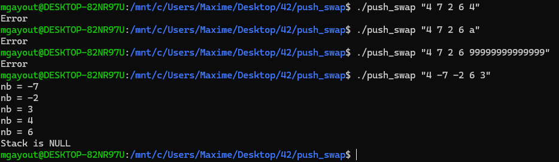

# PUSH_SWAP

## 42 PROJECT

Le projet `PUSH_SWAP` est un programme qui tri une suite de nombres.

Dans ce projet, j'ai utilisé un `algorithme` de `tri par insertion` en me basant sur les travaux de <a href="https://medium.com/@ayogun/push-swap-c1f5d2d41e97">A. Yigit Ogun</a>.

En résumé, voici la logique de cette algorithme :

* Les 3 premiers nombres sont insérés dans une liste chaînée `(B)` et le reste dans une seconde liste `(A)`.

* Une `cible` est attribué à chaque valeur de la liste A.
	* Cette cible est une valeur de la liste B, inférieur et au plus proche de notre valeur de la liste A. 

* Un `coût` est attribué à chaque valeur de la liste A.
	* Ce coût représente le nombre de déplacement pour que la valeur de A et la target de la valeur de A se retrouvent en haut de la liste.

* Le coût le moins élevé représente la valeur a déplacé de la liste A vers la liste B.

* Pour avoir un ensemble de valeurs triées, il suffit de retourné les valeurs de la liste B vers la liste A dans un ordre croissant.

Outre la demande d'utilisation d'un algorithme performant, le projet `PUSH_SWAP` nous permet de comprendre le principe de `HEAP` et `STACK`.

# INSTALL

`make` permet de télécharger les librairies `LIBFT`, `FT_PRINTF` et d'en compiler le contenue afin de créer l'executable `push_swap`.

`make clean` permet de supprimer tout les fichiers objets des librairies.

`make fclean` reprends le principe de `make clean` en supprimant en plus l'executable `push_swap`.

`make re` reprends le principe de `make fclean` en compilant de nouveau.

# TEST

Pour tester ce programme il vous suffit de rentrer les arguments à trier, comme ceci :

`./push_swap "1 3 2"`

ou

`./push_swap 1 3 2`

Pour faciliter vos tests avec des grandes valeurs vous pouvez écrire ceci :

`./push_swap $(seq $a $b | shuf -n $c | tr '\n' ' ')`

* `seq` permet de définir un ensemble de valeur avec `$a` comme valeur minimum et `$b` comme valeur maximum.

* `shuf` permet de générer aléatoirement des nombres avec `$c` représentant le nombre de valeurs a généré.

* `tr` permet de remplacer un caractère par un autre.
	* Ici dans l'exemple, remplacer '\n' par un ' '.

