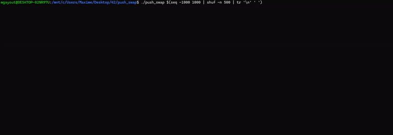

# <p align="center">PUSH_SWAP [Projet 42]</p>

<div align="center">
	<table>
		<tr><th>NOTE</th>
		<th>ENGLISH VERSION</th></tr>
		<tr><th></th>
		<th><a href= "https://github.com/mgayout/push_swap/blob/master/eng/README.md"></a></th></tr>
	</table>
</div>

Le projet `PUSH_SWAP` est un programme qui tri une suite de nombres.

Dans ce projet, j'ai utilisé un `algorithme` de `tri par insertion` en me basant sur les travaux de <a href="https://medium.com/@ayogun/push-swap-c1f5d2d41e97">A. Yigit Ogun</a>.

En résumé, voici la logique de cette algorithme :

* Les 3 premiers nombres sont insérés dans une liste chaînée `(B)` et le reste dans une seconde liste `(A)`.

* Une `cible` est attribué à chaque valeur de la liste A.
	* Cette cible est une valeur de la liste B, inférieur et au plus proche de notre valeur de la liste A. 

* Un `coût` est attribué à chaque valeur de la liste A.
	* Ce coût représente le nombre de déplacement pour que la valeur de A et la target de la valeur de A se retrouvent en haut de la liste.

* Le coût le moins élevé représente la valeur a déplacé de la liste A vers la liste B.

* Pour avoir un ensemble de valeurs triées, il suffit de retourné les valeurs de la liste B vers la liste A dans un ordre croissant.

Outre la demande d'utilisation d'un algorithme performant, le projet `PUSH_SWAP` nous permet de comprendre le principe de `HEAP` et `STACK`.

<p align="center"></p>

## <p> </p>

## <p align="center">INSTALLATION</p>

* Pour télécharger `PUSH_SWAP` :

```shell
git clone https://github.com/mgayout/push_swap.git
```
<div align="center">
	<table>
		<tr><th colspan="2" align="center">Règles</th></tr>
		<tr><td align="center">make</td>
		<td>Compilation</td></tr>
		<tr><td align="center">make clean</td>
		<td>Suppression des fichiers objets</td></tr>
		<tr><td align="center">make fclean</td>
		<td>Suppression des fichiers objets et du programme push_swap</td></tr>
		<tr><td align="center">make re</td>
		<td>Suppression des fichiers objets et de l'archive suivi d'une compilation</td></tr>
	</table>
</div>

* Pour tester `PUSH_SWAP` :

```shell
./push_swap "1 2 3"
```
ou
```shell
./push_swap 1 2 3
```
ou
```shell
./push_swap $(seq $a $b | shuf -n $c | tr '\n' ' ')
```
* `seq` permet de définir un ensemble de valeur avec `$a` comme valeur minimum et `$b` comme valeur maximum.

* `shuf` permet de générer aléatoirement des nombres avec `$c` représentant le nombre de valeurs a généré.

* `tr` permet de remplacer un caractère par un autre.
	* Ici dans l'exemple, remplacer '\n' par un ' '.
