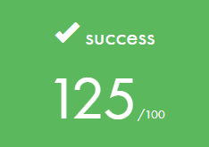

# LIBFT

## 42 PROJECT

Le projet `LIBFT` est une bibliothèque personnelle regroupant de nombreuses fonctions basiques (en C) permettant la manipulation des chaînes de caractères.

Outre les notions de `bibliothèques`, `archives`, `fichiers objets` et `fichiers hearder`, ce projet nous fait découvrir `les fichiers Mafefile`, `les mallocs` et `les listes`. 

# INSTALL

Un simple `make` permet la compilation des fonctions de `LIBFT` en fichier archive `libft.a`.

Libre à vous de tester mes fonctions en compilant votre programme avec cette archive.

`make clean` permet de supprimer tout les fichiers objets, nécessaire à la création de l'archive `libft.a`.

`make fclean` reprends le principe de `make clean` en supprimant en plus l'archive `libft.a`.

`make re` reprends le principe de `make fclean` en compilant de nouveau ma librairie.